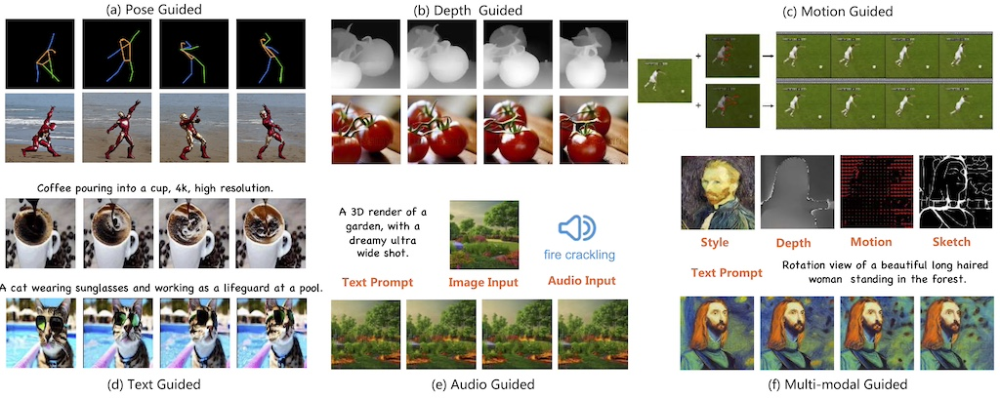
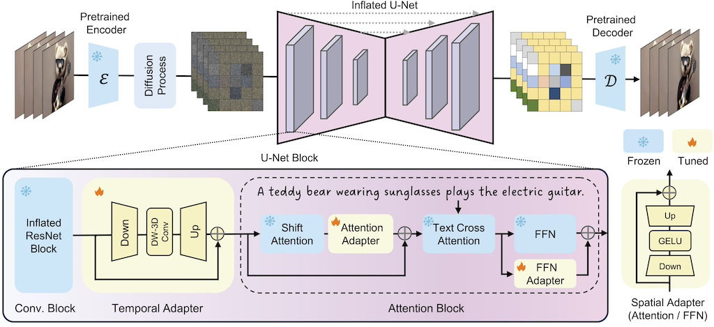
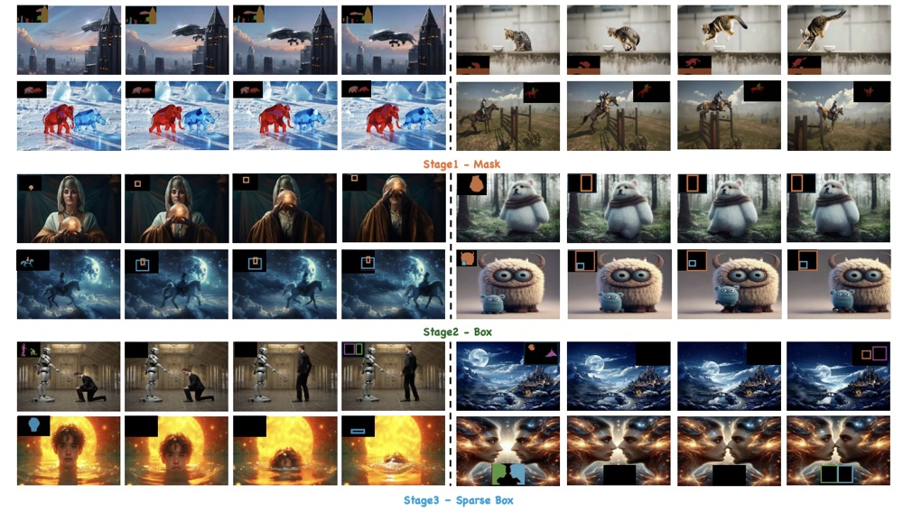
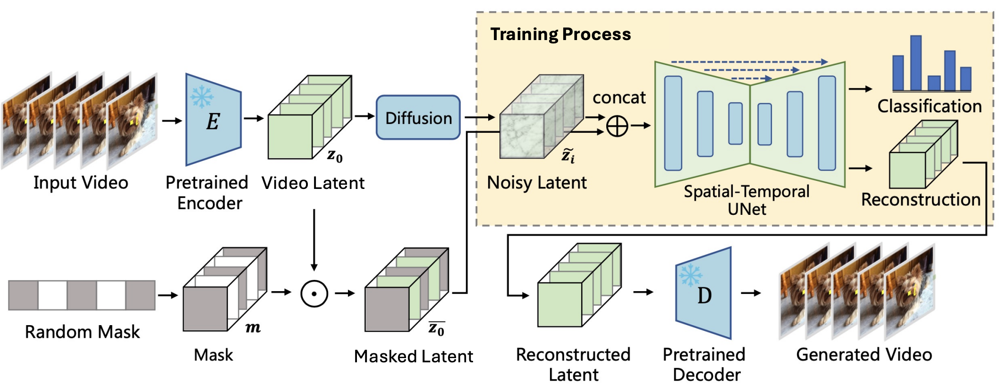
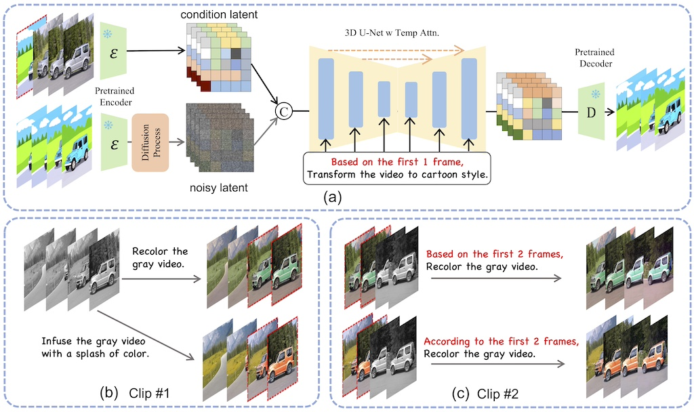
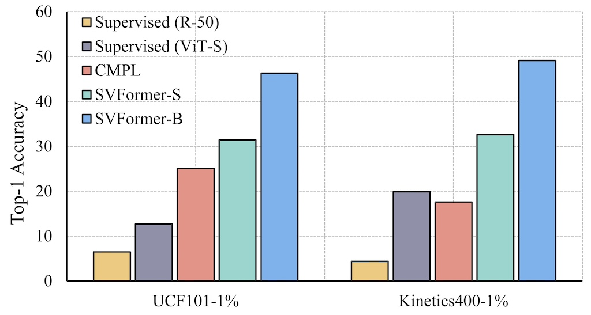
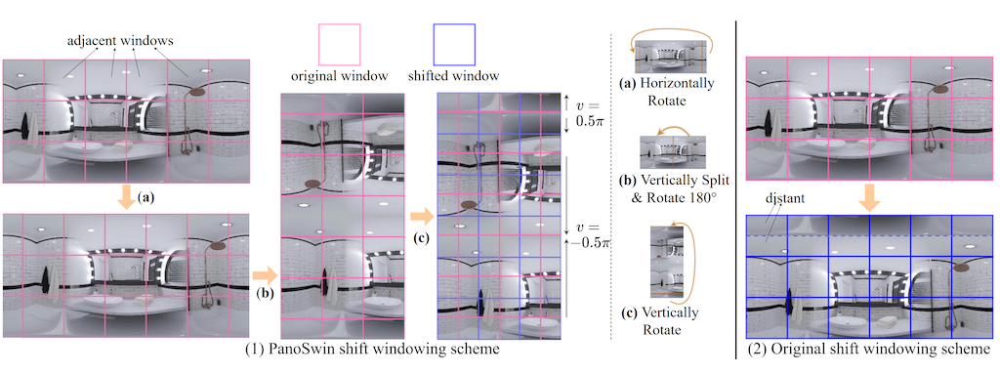
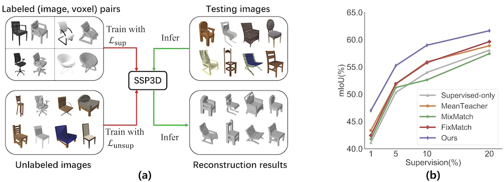

# 📝 Publications 
<!-- 加点表情包,直接复制图片即可  https://github.com/guodongxiaren/README/blob/master/emoji.md?tdsourcetag=s_pcqq_aiomsg -->

A full publication list is available on my [google scholar](https://scholar.google.com/citations?user=yuiXa5EAAAAJ&hl=en&oi=ao) page.

(*: equal contribution; †: corresponding authors.)

<table style="width:100%"><tbody><tr><th width="30%">
  
Video Generation

</th><th style="text-align:left" width="70%"> A Survey on Video Diffusion Models  Zhen Xing, Qijun Feng, Haoran Chen, Qi Dai, Han Hu, Hang Xu, Zuxuan Wu, Yu-Gang Jiang    ACM Computing Survey (<strong>CSUR, IF=23.8</strong>), 2024  [<a href="https://arxiv.org/abs/2310.10647">Paper</a>][<a href="https://github.com/ChenHsing/Awesome-Video-Diffusion-Models">HomePage</a>][<a href="https://zhuanlan.zhihu.com/p/661860981">Zhihu</a>][<a href="https://mp.weixin.qq.com/s/qes6C8UbEYArnVKU3eu9QQ">机器之心</a>][<a href="https://mp.weixin.qq.com/s/viC_J08bVIVRzvRYxRyQTw">量子位</a>]   Surveying 300+ recent literatures on video generation and editing with diffusion models. Acheving Github 2000+ stars.

</th>
</tr></tbody></table>

<table style="width:100%">
<tbody><tr><th width="30%"> 
  
Video Generation

</th><th style="text-align:left" width="70%"> 
SimDA: A Simple Diffusion Adapter for Efficient Video Generation  
Zhen Xing, Qi Dai, Han Hu, Zuxuan Wu, Yu-Gang Jiang 
 IEEE/CVF Conference on Computer Vision and Pattern Recognition (<strong>CVPR</strong>), 2024   
 [<a href="https://arxiv.org/abs/2308.09710">Paper</a>][<a href="https://chenhsing.github.io/SimDA/">HomePage</a>]
</th></tr></tbody></table>

<table style="width:100%"><tbody><tr><th width="30%">
  
Video Generation

</th><th style="text-align:left" width="70%"> StableAnimator: High-Quality Identity-Preserving Human Image Animation
  Shuyuan Tu,  Zhen Xing, Xintong Han, Zhi-Qi Cheng, Qi Dai, Chong Luo, Zuxuan Wu   IEEE/CVF Conference on Computer Vision and Pattern Recognition (<strong>CVPR</strong>), 2025  [<a href="https://arxiv.org/abs/2411.17697">Paper</a>][<a href="https://github.com/Francis-Rings/StableAnimator">Code</a>][<a href="https://francis-rings.github.io/StableAnimator/">Homepage</a>][<a href="https://mp.weixin.qq.com/s/qK3s-us2XeDv7phW83W5BQ">机器之心</a>]   Acheving Github 1200+ stars.

</th>
</tr></tbody></table>

<table style="width:100%"><tbody><tr><th width="30%">
  
Video Generation

</th><th style="text-align:left" width="70%"> MagicMotion: Controllable Video Generation with Dense-to-Sparse Trajectory Guidance   Quanhao Li*, Zhen Xing*, Rui Wang, Hui Zhang, Zuxuan Wu  Technical Report, 2025   [<a href="https://arxiv.org/pdf/2503.16421">Paper</a>][<a href="https://github.com/quanhaol/MagicMotion/">Code</a>][<a href="https://quanhaol.github.io/magicmotion-site/">HomePage</a>][<a href="https://mp.weixin.qq.com/s/oGI4NIkVv9xV-pC19LLc3g">量子位</a>]
</th></tr></tbody></table>

<table style="width:100%"><tbody><tr><th width="30%">
  
Video Generation

</th><th style="text-align:left" width="70%"> GenRec: Unifying Video Generation and Recognition with Diffusion Models   Zejia Weng, Xitong Yang, Zhen Xing, Zuxuan Wu, Yu-Gang Jiang  Annual Conference on Neural Information Processing Systems (<strong>NeurIPS</strong>), 2024   [<a href="https://arxiv.org/abs/2408.15241">Paper</a>]
</th></tr></tbody></table>

<table style="width:100%"><tbody><tr><th width="30%"> 
  
Video Generation

</th><th style="text-align:left" width="70%"> AID: Adapting Image2Video Diffusion Models for Instruction-based Video Prediction  Zhen Xing, Qi Dai, Zejia Weng, Zuxuan Wu, Yu-Gang Jiang  Technical Report, 2024   [<a href="https://arxiv.org/abs/2406.06465">Paper</a>][<a href="https://chenhsing.github.io/AID/">HomePage</a>]
</th></tr></tbody></table>

<table style="width:100%"><tbody><tr><th width="30%">
  
Video Editing

</th><th style="text-align:left" width="70%"> VIDiff: Translating Videos via Multi-Modal Instructions with Diffusion Models  Zhen Xing, Qi Dai, Zihao Zhang, Hui Zhang, Han Hu, Zuxuan Wu, Yu-Gang Jiang  Technical Report, 2024   [<a href="https://arxiv.org/abs/2311.18837">Paper</a>][<a href="https://chenhsing.github.io/VIDiff/">HomePage</a>][<a href="https://zhuanlan.zhihu.com/p/670615911">Zhihu</a>]
</th></tr></tbody></table>

<table style="width:100%"><tbody><tr><th width="30%">
  
Video Recongnition

</th><th style="text-align:left" width="70%"> SVFormer: Semi-supervised Video Transformer for Action Recognition   Zhen Xing, Qi Dai, Han Hu, Jingjing Chen, Zuxuan Wu, Yu-Gang Jiang  IEEE/CVF Conference on Computer Vision and Pattern Recognition (<strong>CVPR</strong>), 2023   [<a href="https://arxiv.org/abs/2211.13222">Paper</a>][<a href="https://github.com/ChenHsing/SVFormer">Code</a>]
</th></tr></tbody></table>

<table style="width:100%"><tbody><tr><th width="30%"> 
  
3D Understanding

</th><th style="text-align:left" width="70%"> PanoSwin: a Pano-style Swin Transformer for Panorama Understanding   Zhixin Ling, Zhen Xing, Manliang Cao, Xiangdong Zhou  IEEE/CVF Conference on Computer Vision and Pattern Recognition (<strong>CVPR</strong>), 2023   [<a href="https://openaccess.thecvf.com/content/CVPR2023/papers/Ling_PanoSwin_A_Pano-Style_Swin_Transformer_for_Panorama_Understanding_CVPR_2023_paper.pdf">Paper</a>][<a href="https://github.com/1069066484/PanoSwinTransformerObjectDetection">Code</a>]
</th></tr></tbody></table>

<table style="width:100%"><tbody><tr><th width="30%"> 
  
3D Generation

</th><th style="text-align:left" width="70%"> Semi-supervised Single-view 3D Reconstruction via Prototype Shape Priors   Zhen Xing, Hengduo Li, Zuxuan Wu, Yu-Gang Jiang  European Conference on Computer Vision (<strong>ECCV</strong>), 2022   [<a href="https://arxiv.org/abs/2209.15383">Paper</a>][<a href="https://github.com/ChenHsing/SSP3D">Code</a>]
</th></tr></tbody></table>

<table style="width:100%"><tbody><tr><th width="30%"> 
  
3D Generation

</th><th style="text-align:left" width="70%"> Few-shot Single-view 3D Reconstruction with Memory Prior Contrastive Network   Zhen Xing, Yijiang Chen, Zhixin Ling, Xiangdong Zhou, Yu Xiang  European Conference on Computer Vision (<strong>ECCV</strong>), 2022   [<a href="https://arxiv.org/abs/2208.00183">Paper</a>][<a href="#">Code</a>]
</th></tr></tbody></table>

<table style="width:100%"><tbody><tr><th width="30%"> 
  
Image Retrieval

</th><th style="text-align:left" width="70%"> Conditional Stroke Recovery for Fine-Grained Sketch-Based Image Retrieval   Zhixin Ling, Zhen Xing,Jian Zhou, Xiangdong Zhou  European Conference on Computer Vision (<strong>ECCV</strong>), 2022   [<a href="https://www.ecva.net/papers/eccv_2022/papers_ECCV/papers/136860708.pdf">Paper</a>][<a href="https://github.com/1069066484/CSR-ECCV2022">Code</a>]
</th></tr></tbody></table>

- ​**​AdaDiff: Adaptive Step Selection for Fast Diffusion​**​  
  Hui Zhang, Zuxuan Wu, ​**​Zhen Xing​**​, Jie Shao, Yu-Gang Jiang  
  ​**​AAAI​**​, 2025, [[Paper](https://arxiv.org/abs/2311.14768)]

- ​**​Advancing Dark Action Recognition via Modality Fusion and Dark-to-Light Diffusion Model​**​  
  Yuxuan Wang, ​**​Zhen Xing​**​, Zuxuan Wu  
  ​**​ICASSP​**​, 2025, [[Paper](https://ieeexplore.ieee.org/abstract/document/10890723)]

- ​**​Human2Robot: Learning Robot Actions from Paired Human-Robot Videos​**​  
  Sicheng Xie, Haidong Cao, Zejia Weng, ​**​Zhen Xing​**​, Shiwei Shen, Jiaqi Leng, Xipeng Qiu, Yanwei Fu, Zuxuan Wu, Yu-Gang Jiang  
  ​**​Arxiv​**​, 2025, [[Paper](https://arxiv.org/pdf/2502.16587)]

- ​**​Aligning Vision Models with Human Aesthetics in Retrieval: Benchmarks and Algorithms​**​  
  Miaosen Zhang, Yixuan Wei, ​**​Zhen Xing​**​, Yifei Ma, Zuxuan Wu, Ji Li, Zheng Zhang, Qi Dai, Chong Luo, Xin Geng, Baining Guo  
  ​**​NeurIPS​**​, 2024, [[Paper](https://arxiv.org/pdf/2406.06465.pdf)], [[HomePage](https://chenhsing.github.io/AID/)]

- ​**​FDGaussian: Fast Gaussian Splatting via Geometric-aware Diffusion Model​**​  
  Qijun Feng, ​**​Zhen Xing​**​, Zuxuan Wu, Yu-Gang Jiang  
  ​**​Arxiv​**​, 2024, [[Paper](https://arxiv.org/pdf/2403.10242.pdf)], [[HomePage](https://qjfeng.net/FDGaussian/)]

- ​**​TranSFormer: Slow-Fast Transformer for Machine Translation​**​  
  Bei Li, Yi Jing, Xu Tan, ​**​Zhen Xing​**​, Tong Xiao, Jingbo Zhu  
  ​**​ACL (Findings)​**​, 2023, [[Paper](https://arxiv.org/pdf/2305.16982.pdf)]

- ​**​Multi-Level Region Matching for Fine-Grained Sketch-Based Image Retrieval​**​  
  Zhixin Ling, ​**​Zhen Xing​**​, Jiangtong Li, Li Niu  
  ​**​ACM MM​**​, 2022, [[Paper](https://www.jiangtongli.me/publication/mlmr/mlmr.pdf)]

- ​**​3D-Augmented Contrastive Knowledge Distillation for Image-based Object Pose Estimation​**​  
  Zhidan Liu, ​**​Zhen Xing​**​, Xiangdong Zhou, Yijiang Chen, Guichun Zhou  
  ​**​ICMR​**​, 2022, [[Paper](https://arxiv.org/pdf/2206.02531.pdf)]

- ​**​CaSS: A Channel-aware Self-supervised Representation Learning Framework for Multivariate Time Series Classification​**​  
  Yijiang Chen, Xiangdong Zhou, ​**​Zhen Xing​**​, Zhidan Liu, Minyang Xu  
  ​**​DASFFA​**​, 2022, [[Paper](https://arxiv.org/pdf/2203.04298.pdf)]

- ​**​From Coarse to Fine: Hierarchical Structure-aware Video Summarization​**​  
  Wenxu Li, Gang Pan, Chen Wang, ​**​Zhen Xing​**​, Zhenjun Han  
  ​**​TOMM​**​, 2022, [[Paper](https://dl.acm.org/doi/abs/10.1145/3485472)]