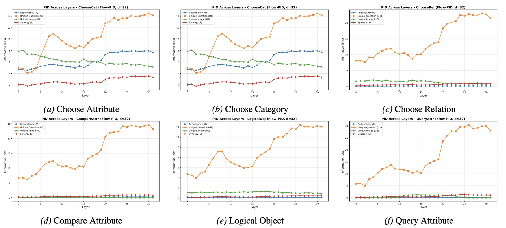

# 📝 Publications 
<!-- 加点表情包,直接复制图片即可  https://github.com/guodongxiaren/README/blob/master/emoji.md?tdsourcetag=s_pcqq_aiomsg -->

A full publication list is available on <a href="https://scholar.google.com/citations?user=Gdp0CIwAAAAJ&hl=en&oi=ao">[Google Scholar]</a> <a href="https://www.semanticscholar.org/author/Xueqing-Zhou/2363598820">[Semantic Scholar]</a>

(*: equal contribution; †: project leader)

Multimodal Diagnostics

<strong style="font-size:18px">How Vision Becomes Language: A Layer-wise Information-Theoretic Analysis of Multimodal Reasoning</strong>  Hongxuan Wu, Yukun Zhang, <strong style="font-size:16px">Xueqing Zhou</strong>  arXiv preprint, 2026  [<a href="https://arxiv.org/abs/2602.15580">Paper</a>]   <strong>TL;DR:</strong> A layer-wise PID framework + causal attention knockouts that quantify “vision → language” transduction across depth, turning mechanistic analysis into a practical diagnostic tool for architecture and inference-time interventions.

Long-Context & Systems

<strong style="font-size:18px" >Continuous-Time Attention: PDE-Guided Mechanisms for Long-Sequence Transformers</strong>  <strong style="font-size:16px">Yukun Zhang*</strong>, <strong style="font-size:16px">Xueqing Zhou*</strong>  <strong>EMNLP</strong>, 2025 (Main)  [<a href="https://aclanthology.org/2025.emnlp-main.1097.pdf">Paper</a>][<a href="https://xueqingzhou.github.io/Continuous-Time-Attention/">Project</a>][<a href="https://github.com/XueqingZhou/Continuous-Time-Attention">Code</a>]   <strong>TL;DR:</strong> Reimagines attention as a continuous-time PDE evolution for long sequences; emphasizes algorithm–system co-design via kernel/serving-friendly operators and evidence-first evaluation for long-context efficiency.

Transformer Architecture

<strong style="font-size:18px">Where to Add PDE Diffusion in Transformers</strong>  <strong style="font-size:16px">Yukun Zhang</strong>, <strong style="font-size:16px">Xueqing Zhou</strong>  arXiv preprint, 2025  [<a href="https://arxiv.org/abs/2510.03272">Paper</a>]   <strong>TL;DR:</strong> Shows diffusion and attention generally do not commute—placement matters; provides a principled template for composing local-global modules, guiding efficient-architecture design choices under long-sequence constraints.

Transformer Architecture

<strong style="font-size:18px">Understanding Transformer Architecture through Continuous Dynamics: A Partial Differential Equation Perspective</strong>  <strong style="font-size:16px">Yukun Zhang</strong>, <strong style="font-size:16px">Xueqing Zhou</strong>  arXiv preprint, 2024  [<a href="https://arxiv.org/abs/2408.09523">Paper</a>]   <strong>TL;DR:</strong> A PDE lens that turns Transformer components into interpretable operators, explaining why stabilizers like residual connections and layer norm are essential—useful for reasoning about stability/efficiency trade-offs in deep architectures.

