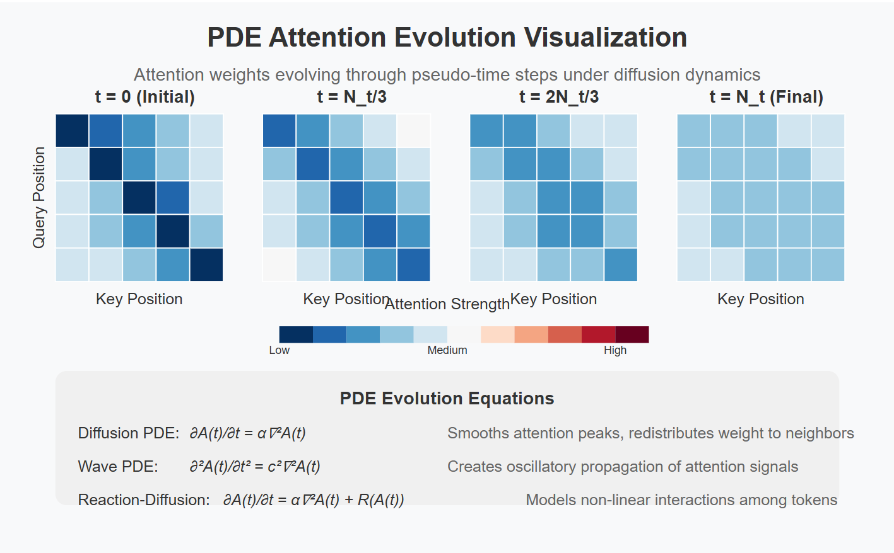
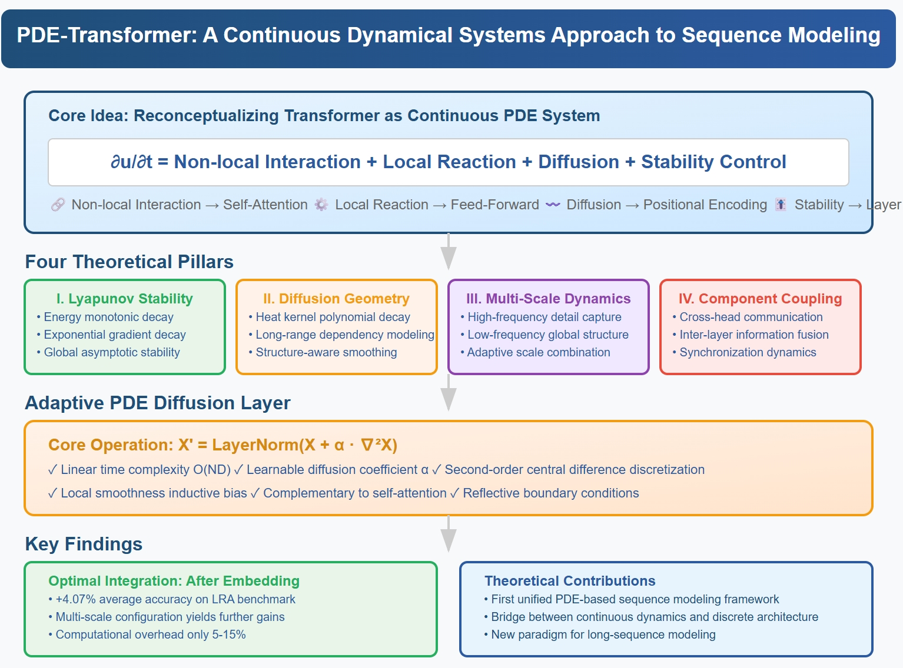
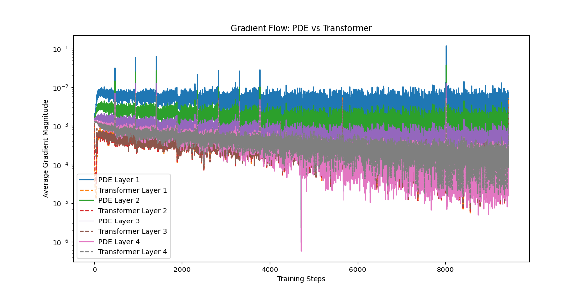

# 📝 Publications 
<!-- 加点表情包,直接复制图片即可  https://github.com/guodongxiaren/README/blob/master/emoji.md?tdsourcetag=s_pcqq_aiomsg -->

A full publication list is available on <a href="https://scholar.google.com/citations?user=Gdp0CIwAAAAJ&hl=en&oi=ao">[Google Scholar]</a> <a href="https://www.semanticscholar.org/author/Xueqing-Zhou/2363598820">[Semantic Scholar]</a>

(*: equal contribution; †: project leader)

Transformer Architecture

<strong style="font-size:18px" >Continuous-Time Attention: PDE-Guided Mechanisms for Long-Sequence Transformers</strong>  <strong style="font-size:16px">Yukun Zhang*</strong>, <strong style="font-size:16px">Xueqing Zhou*</strong>  Conference on Empirical Methods in Natural Language Processing (<strong>EMNLP</strong>), 2025  [<a href="https://aclanthology.org/2025.emnlp-main.1097.pdf">Paper</a>][<a href="https://xueqingzhou.github.io/Continuous-Time-Attention/">Project</a>][<a href="https://github.com/XueqingZhou/Continuous-Time-Attention">Code</a>]   A PDE-guided formulation of self-attention that treats token interactions as trajectories of a continuous-time dynamical system, improving long-sequence modeling efficiency and stability.

Transformer Architecture

<strong style="font-size:18px">PDE-Transformer: A Continuous Dynamical Systems Approach to Sequence Modeling</strong>  <strong style="font-size:16px">Yukun Zhang*</strong>, <strong style="font-size:16px">Xueqing Zhou*</strong>  arXiv preprint, 2025   [<a href="https://arxiv.org/abs/2510.03272">Paper</a>]

Transformer Architecture

<strong style="font-size:18px">Understanding Transformer Architecture through Continuous Dynamics: A Partial Differential Equation Perspective</strong>  <strong style="font-size:16px">Yukun Zhang*</strong>, <strong style="font-size:16px">Xueqing Zhou*</strong>  arXiv preprint, 2024   [<a href="https://arxiv.org/abs/2408.09523">Paper</a>]

